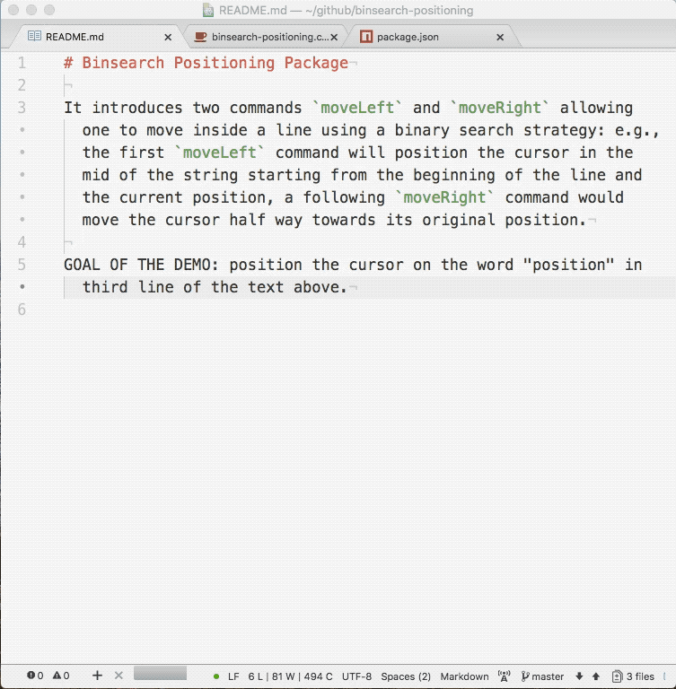

# Binsearch Positioning Package

It introduces two commands `moveLeft` and `moveRight` allowing one to move inside a line using a binary search strategy: e.g., the first `moveLeft` command will position the cursor in the mid of the string starting from the beginning of the line and the current position, a following `moveRight` command would move the cursor half way towards its original position.

## Key bindings

- `ctr-<` will move the custor towards the left of the line (halfway distance between the current position and the last used position on that side);
- `ctr->` will move the custor towards the right of the line (halfway distance between the current position and the last used position on that side);

## Issues

I am not familiar with Atom development, contributions to this package will be very welcome.
